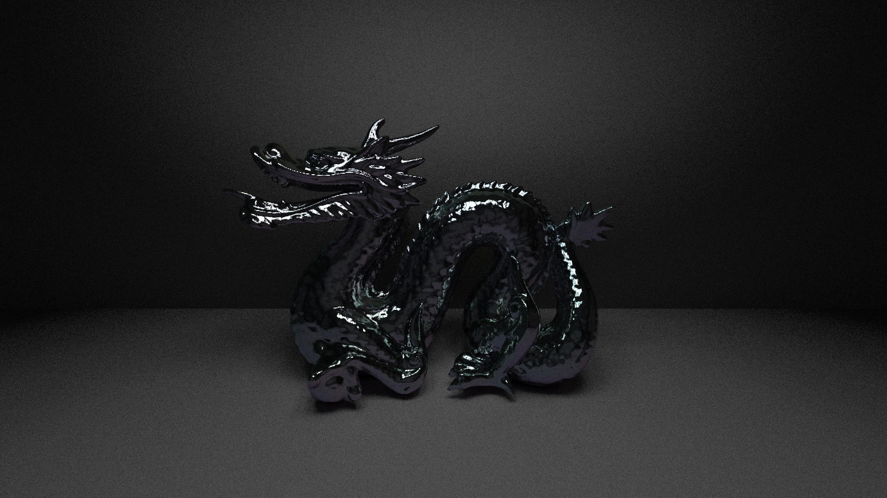

# C++ Ray Tracing Engine
Undergraduate Thesis for Millersville University of Pennsylvania

To download:
```
git clone https://github.com/JohnHynes/Thesis.git --recursive
```

Run inside of the root directory of this project:
```
mkdir build
cd build
cmake ..
make
```

Sample rendering of a "stanford dragon":

